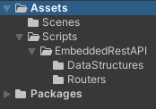
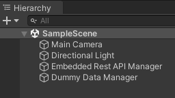
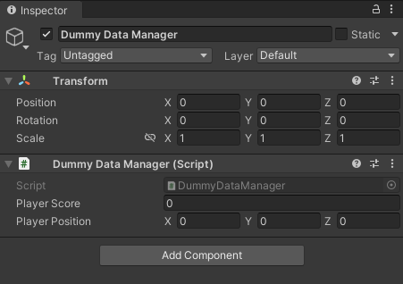
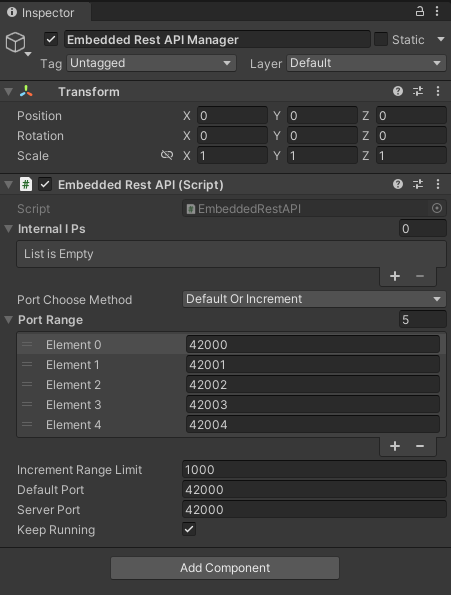

# Project Overview

This Unity project contains some modifications to a standard, barely-touched Unity project made with the 3D (Core) Project template.

## The Project Structure

The project is fairly barebones, so its project structure is really only special in the "Scripts" directory.

The Scripts folder contains a few things:
- A DummyDataManager script to help generate and manage some data to show the API server in-action.
- The EmbeddedRestAPI folder, containing all scripts and data structures relevant to the API and its ability to process & respond to network traffic.

Essentially, within the EmbeddedRestAPI folder are:
- Routers, to help direct network traffic to the right functions or methods to process and respond to that traffic.
- DataStructures, to help shape the responses that specific routes will send back to clients. Each response may have its own data structure, as each response may send back slightly different JSON in this JSON-serving API.
- The EmbeddedRestAPI script, which kicks off all the functionality for the API when used within a game scene.

The Scenes folder contains the SampleScene file, explained more below.

## The Game's One Scene

The project contains the usual SampleScene file found within `Assets/Scenes/` and uses that as the level to demo all functionality.

As the project is not involving any actual gameplay or visuals, the Main Camera and Directional Light are untouched.

There is a "Dummy Data Manager" gameobject in the SampleScene that essentially acts as a data structure, set up in a way that other gameobjects can access its data during the game's runtime.

There is an "Embedded Rest API Manager" gameobject in the SampleScene - that is where the magic happens. It includes the EmbeddedRestAPI script on it, ensuring that the API runs when the gameobject is loaded during the game's runtime.

In this project, the API server boots up automatically when the scene is loaded. Make sure you've finished fiddling with the settings before you play the scene!

That's basically it, for project overview. See other pages for deep-dives into the functionality!