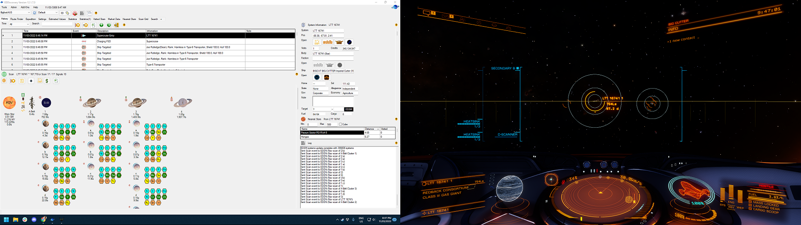
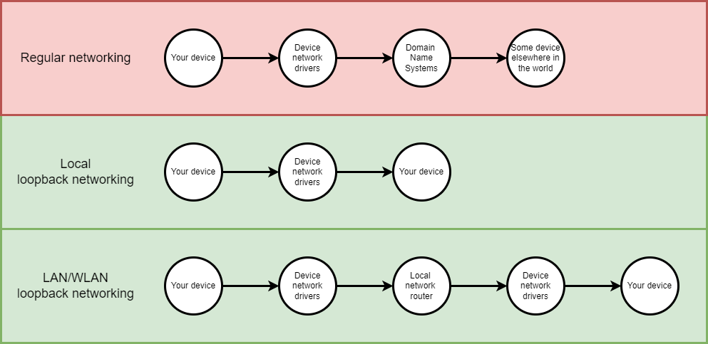

# Unity With Embedded REST Server

This project showcases a way to allow Unity-based applications to communicate data to external tools by building a REST API within the Unity project.

## TLDR

- Unity games can serve data locally by running a server from within the game executable.
- The server is built with the standard [HttpListener](https://docs.microsoft.com/en-us/dotnet/api/system.net.httplistener?view=netstandard-2.0) class, no additional packages or software required.
- The server runs on localhost or on a LAN/WLAN IP address, no actual server hosting/deployment needed.
- Game data needs to be structured in a way that our server can easily grab it.
- Examples provided of how other apps can make requests to that server.

This page contains some of the key info, but please check out the Documentation directory for more information.
* [Project Overview page](ProjectOverview.md)
* [Server Functionality page](ServerFunctionality.md)

## Wait, what? 

A Unity game is just another piece of software, whether it's a C# executable on a PC or a C++ ROM on a console. Either way, it's built in C# - and almost all things that regular C# applications can do can also be done within Unity games.

So, a Unity game can _be_ a web server.

No, this isn't "my game is making web requests to an API to get data from an external source". 

This is "my game *is* an API that serves data to other software".

And best of all: this works alongside whatever regular game logic or programming you'd have in a project. Your game can become "a game plus a web server".

## But why?

If you've ever played a really data-intensive game such as Elite Dangerous, you may have heard about tools like "EDDiscovery" - third-party tools that allow players to see game data (or more data) in an easy-to-work-with way. But the game developers have nothing to do with that... right? 

Basically, when game data is stored in a way that is easy to access for modders or other developers, you'll see community-managed tools pop up that support your game. Much in the same way that mods helped games like Skyrim have a longer lifespan, these community-managed tools help data-intensive games live longer too. As a developer, if you want to let stuff like that happen, then you need to provide something for those lovely community developers to work with.

This project shows just one way for us to place game data in a way that's friendly for external applications to use: we're going to build an embedded server within our game that can serve up game data to apps that request it.

Also, if you're here looking for corporate/business-oriented reasons to do this: 

> Functionality provided by embedded servers in games allow you to build tools that essentially enable the functionality of wizards or other "automagic" tools for debugging & troubleshooting. 
> 
> For example, if a user is having troubles in their game, make them visit your support website with the game open. The support website can have some JavaScript running that makes web requests to the game's server for any required logs or other game data without asking the user to enter that stuff manually. This helps prevents human errors in error reporting and can even speed up user-facing troubleshooting!

## What do we need? 

Nothing! I mean, if you're a Unity developer with a version of the Unity Editor installed, you have everything that you need already. 

## TODO

* Examples of routes and game functionality that uses multiple levels of forward slashes in their requests (eg. "localhost:port/commands/settimeofday/0800")
* Examples of requests that error out with specific exception classes (and provide specific error data in their responses)
* Examples of authenticated and authorized server routes
* Polish the POST request example so that it uses raw JSON data clearly
* Document the routers
* Document the response data structures
* Move content to wiki pages on GitHub

## Deeper Dives

### Is this a loopback server?

Yes! No, it's not a [LoopBack server](https://loopback.io/). It's just a loopback server. Yeah, I hate that product name.

Basically: regular servers manage access to resources, data, functionality and typically expose that stuff to the world in a controlled way, such as a domain name or IP address.

Loopback servers do that, but do not expose that stuff to the world - they expose it to the same machine or local network that the server currently runs on. This is because it all runs on "localhost" or on a local network IP address - it's not as "public" as a regular server. 

If you monitor an app with a networking analytics tool like NetLimiter, you'll see some apps take up bandwidth with standard internet usage. Loopback applications will skew those analytics though - it's still network traffic, even if it's not actually going out to the internet. This behaviour can cause concern in some consumers (see: [Logitech G Hub concerns on Reddit](https://www.reddit.com/r/LogitechG/comments/mv59w5/logitech_g_hub_uploads_and_downloads_30mb_files/)) - like, why does this app use so much internet bandwidth even when the computer is offline? It's because the app still uses internet communication systems and network drivers to communicate locally.

### But EDDiscovery doesn't akshually work that way!
I know, I know - it reads from the journal files that the game generates. But reading and writing files is standard, every Unity developer worth their salt already knows how to do that! 

Basically, this whole "embedded server" thing presents another way to do data communication without using file IO. Knowing your options for data communication can be handy, especially when working with platforms that want you to limit your system resource usage (eg. consoles that say "don't write to disk more than once per minute!", because that's a real restriction on some platforms).

EDDiscovery is a "close to home" example of data communication between games and community tools for me; I can't play Elite Dangerous without it! Some games just benefit from having additional data displayed while playing the game. The app _does_ include an option to enable an embedded server as well; it provides ways to access the application's data and views from external devices - that type of functionality can be enabled through this embedded server stuff too!